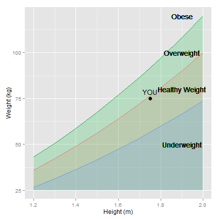

## What is the BMI?

According tho [Wikipedia](https://en.wikipedia.org/wiki/Body_mass_index), the Body Mass Index "is an attempt to quantify the amount of tissue mass (muscle, fat, and bone) in an individual, and then categorize that person as underweight, normal weight, overweight, or obese based on that value."

This is done using the following formula:

$$ BMI = w/h^2 $$

where $w$ is the weight in kg and $h$ is the height in m.


--- .class #id 


## What does this App do?

The [BMI App](https://yamiomar88.shinyapps.io/BMI_App) takes your weight (in either kg or lb) and your height (in either cm or in) and calculates your BMI (in kg/m2) using the formula introduced in the previous slide. So, for example if you weight 75 kg and are 175 cm tall:


```r
wt <- 75        #kg
ht <- 175       #cm
BMI <- wt/(ht/100)^2
BMI
```

```
## [1] 24.4898
```

The complete code (including transformation from English to International units) is available in [Github](https://github.com/YamiOmar88/Developing_Data_Products_Course_Project).


--- .class #id 


## What else does this App do?

The App then tells you what category you belong to according to the World Health Organization's classification table and plots the result in your screen. For our previous example:



--- .class #id 


## Is that all?

No! The App will also ask for your nationality and will provide you with the latest information on BMI from your country available in the [Global Body Mass Index Database](http://apps.who.int/bmi/index.jsp) from the WHO.

And that's not all! We will also tell you a bit about the diet composition (different food categories, in Cal/day) in the geographical region to which your country belongs!

I hope you are eigher about checking your BMI! Click [here](https://yamiomar88.shinyapps.io/BMI_App) and I'll take you there!
